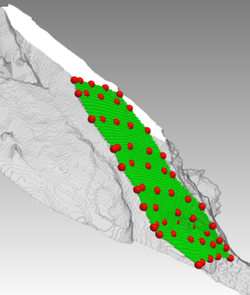

# surfrecon

surfrecon is developed to reconstruct a surface (green shown in the following figure) from a point cloud (red). The surface reconstruction method we use Digne's scale space meshing approach [[1][]] implemented in CGAL. The voxelization method we use Zlatanova's efficient implementation [[2][]] of Laine's topological voxelization method [[3][]]. The following figure is visualized in [NeuTu][].

## compile with cmake

Install [CGAL][] by following the instructions on their [web site][CGAL]. This is required for the reconstruction of the surface.

Install [gflags][] for using the command lines. This is an option for compiling the example code.

## conda installation

To create your own conda environment:

    % conda create -n <YOUR_CONDA_ENV> boost gmp mpfr
    % source activate <YOUR_CONDA_ENV>

To install cgal:

    % git clone https://github.com/CGAL/cgal.git
    % cmake . -DCMAKE_PREFIX_PATH=path_to_your_conda_env
    % make
    % cp -r include/CGAL <YOUR_CONDA_ENV>/include
    % cp lib/* <YOUR_CONDA_ENV>/lib/

To install surfrecon:

    % git clone https://github.com/gnayuy/surfrecon.git
    % cmake . -DCMAKE_PREFIX_PATH=path_to_your_conda_env
    % make
    % cp src/surfrecon.h <YOUR_CONDA_ENV>/include
    % cp src/libsurfrecon.dylib <YOUR_CONDA_ENV>/lib

## api

To use surfrecon library, you need include surfrecon.h and call the function Surf.surfrecon(PointCloud pcIn, Voxels voxelOut).

Other parameters: Surf.surfrecon(PointCloud pcIn, Voxels voxelOut, int co, int num_threads). By default, co=26 and num_threads=8 (if OpenMP is supported by your compiler).

## test

./surfvol -pc <$PointCloud> -o <$Voxels>

For example, copy point.swc from data folder to your surfvol folder and then type "./surfvol -pc points.swc -o voxels.swc".

## file formats

[OFF][]: object file format

[SWC][]: neuron file format

## references

[1]. Digne, Julie, et al. "Scale space meshing of raw data point sets." Computer Graphics Forum. Vol. 30. No. 6. Blackwell Publishing Ltd, 2011.

[2]. Zlatanova, Sisi, et al. "Towards 3D raster GIS: On developing a raster engine for spatial DBMS." ISPRS WG IV/2 Workshop" Global Geospatial Information and High Resolution Global Land Cover/Land Use Mapping" Novosibirsk, Russian Federation, 21 April 2016.

[3]. Laine, Samuli. "A topological approach to voxelization." Computer Graphics Forum. Vol. 32. No. 4. Blackwell Publishing Ltd, 2013.

[NeuTu]:http://www.neutracing.com
[CGAL]: http://www.cgal.org
[gflags]: https://github.com/gflags/gflags
[OFF]: http://www.geomview.org/docs/html/OFF.html#OFF
[SWC]: http://www.neuronland.org/NLMorphologyConverter/MorphologyFormats/SWC/Spec.html
[1]: http://onlinelibrary.wiley.com/doi/10.1111/j.1467-8659.2011.01848.x/full
[2]: http://www.sciencedirect.com/science/article/pii/S2215016116000029
[3]: http://onlinelibrary.wiley.com/doi/10.1111/cgf.12153/full
